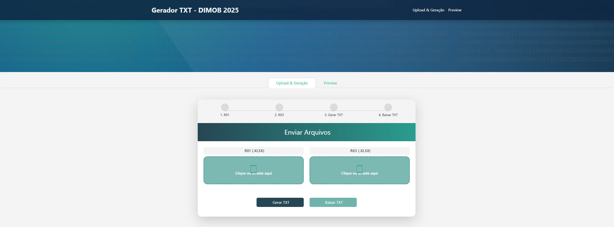
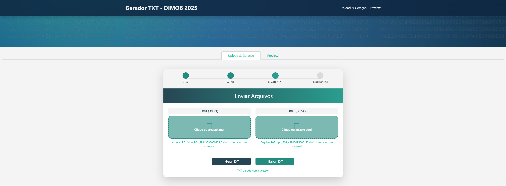
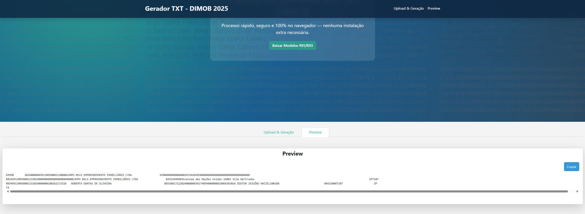

# Gerador de TXT – DIMOB 2025

Aplicação web desenvolvida com Python e Dash que converte planilhas Excel dos tipos R01 e R03 no formato **.TXT** exigido pela Receita Federal para a entrega da declaração **DIMOB**. O processo é todo feito no navegador, sem necessidade de instalação de software adicional.

---

### 🖼️ Interface da Aplicação






---

## 🔧 Funcionalidades

- 📁 **Upload de arquivos Excel** nos formatos R01 e R03  
- ⚙️ **Geração automática** do arquivo `.txt` conforme layout da DIMOB  
- 🧪 **Validação de campos obrigatórios** com feedback visual em tempo real  
- 📤 **Exportação do arquivo em ANSI (Windows-1252)** pronto para envio  
- 📎 **Botão para copiar o conteúdo gerado** para área de transferência  
- ✅ **Stepper interativo** com visualização em tempo real do progresso por etapas  
- 🎨 **Interface moderna**, com estilos personalizados e responsiva

---

## 📦 Regras

- Header = 375 colunas
- R01 = 271 colunas
- R03 = 250 colunas
- T9 = 103 colunas

---

## 🚀 Fluxo de Uso

1. **Selecione o arquivo R01 (.xlsx)**  
2. **Selecione o arquivo R03 (.xlsx)**  
3. Clique em **Gerar TXT** para visualizar o conteúdo formatado  
4. Clique em **Baixar TXT** ou use o botão **Copiar**

Todos os campos são tratados com padding e formatação conforme especificações da Receita Federal.

---

## 📂 Estrutura do Projeto

```
📦 gerar_txt_app
├── app.py
├── layout.py
├── callbacks.py
├── requirements.txt
├── assets/
│   ├── styles.css
│   ├── arquivotxt.png
│   ├── print1.png
│   ├── print2.png
│   ├── print3.png
│   ├── print4.png
│   ├── tipo_R01.xlsx
│   └── tipo_R03.xlsx
```

---

## 📦 Dependências

As bibliotecas utilizadas estão listadas no arquivo `requirements.txt`. Principais:

- `dash` — Framework principal do app  
- `dash-bootstrap-components` — Estilização baseada em Bootstrap  
- `pandas` — Manipulação dos arquivos Excel  
- `openpyxl` — Leitura de planilhas `.xlsx`

---

## 🛠️ Como Executar

1. Clone o repositório:

```bash
git clone https://github.com/paesdj1987/gerador_txt_dimob.git
cd gerador_txt_dimob
```

2. Instale as dependências:

```bash
pip install -r requirements.txt
```

3. Execute o projeto:

```bash
python app.py
```

---

## 📥 Modelos de Arquivo

Estão disponíveis modelos válidos de arquivos `.xlsx` em:

- `assets/tipo_R01.xlsx`  
- `assets/tipo_R03.xlsx`  

Você pode baixá-los diretamente pela aplicação, clicando no botão **“Baixar Modelos R01/R03”** na tela inicial.

---

## 👤 Autor

Desenvolvido por João Paes  
🔗 [github.com/paesdj1987](https://github.com/paesdj1987)
